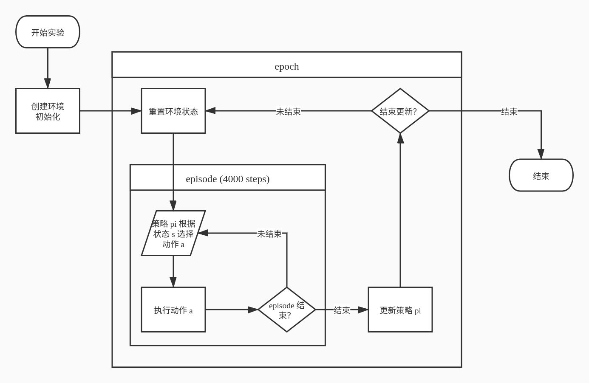
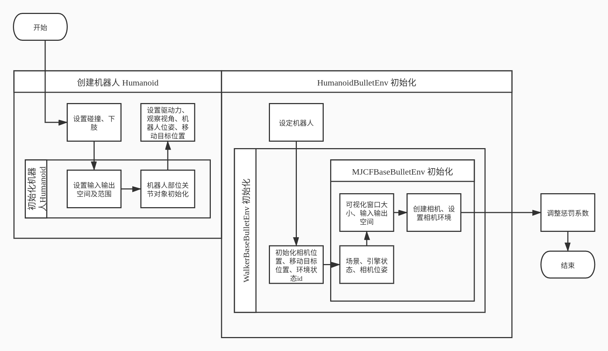
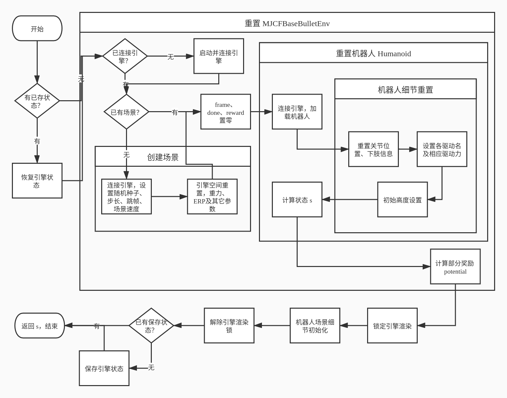
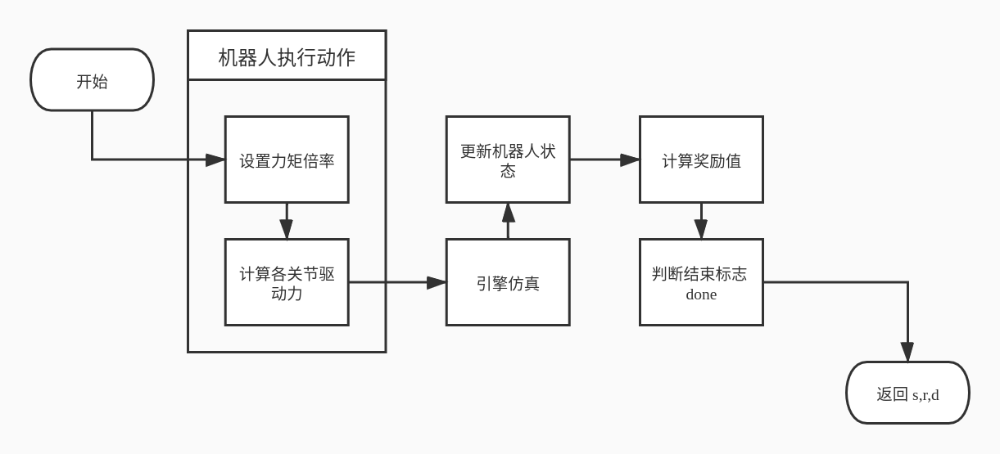

## 2020.5.10 星期日

新装了ubuntu20.04 LTS  
安装了 spinningup  
新系统的软件及设置

## 2020.5.11 星期一

修改 /home/chk/spinningup/spinup/user_config.py 文件  
将 spinningup 训练数据默认保存路径为 "/home/chk/文档/Centaur/data"  
`DEFAULT_DATA_DIR = "/home/chk/文档/Centaur/data"`  

安装了 pybullet：  
`pip3 install pybullet`  

pybullet GUI (21.482s) 与 DIRECT (21.082s) 模式在时间上没有差别  
其中 GUI 还有图像界面出现  

目前想法是用 pybullet 注册 gym 环境，然后用 spinningup 直接跑  
存在以下问题：  
1. spinningup 的命令行模式无法直接运行 pybullet_gym 环境  
   + ~~下面两种方法并没有解决训练问题，每次训练时都会提前截断轨迹，而没有正常进行训练，应该是因为 pybullet 的问题导致的~~  
     接下来去找 pybullet 自带的环境源码看看情况，再尝试自己编写 pybullet+gym 的环境时弄懂了，该问题已解决  
   + ~~这个问题暂时用 `gym_env.py` 解决了~~  
     数据图表可以用 plot 画出来  
     但是测试出现问题: `pybullet.error: Couldn't restore state.`   
     已解决，这是因为 test_policy 使用了保存下来的环境数据，使用时没有重新 connect pybullet 引擎，只要重新 make 一下，再用 run_policy 测试即可，详见 `my_test_policy.py`
   + 另一种方法: 在 `gym/envs/__init__.py` 6-11 行注册了 pybullet_gym 的环境，注册后即可用命令行进行训练  
2. 看 pybullet 自带的 gym 环境非常复杂，如果自己写环境也这么复杂的话怕是有点困难  
3. 参数的调整将会是个复杂且长期的工作  

## 2020.5.12-2020.5.28

~~pybullet_gym 毕竟不是纯粹的 gym 环境，适配的问题较大，决定暂时搁置~~  
接下来尝试自己写使用 pybullet 的 gym 环境：  
- [x] 写一个没有 pybullet 的简单环境并注册到 gym 中进行训练  
    - [x] 使用 gym [官方教程](https://github.com/openai/gym/blob/master/docs/creating-environments.md)注册一个空环境  
    - [x] 完成，训练、测试、画图均正常，见 myGymEnv/， 主要参考了 gym-pendulum 源码;~~参考 [gym-soccer](https://github.com/openai/gym-soccer)、[OpenAI Gym构建自定义强化学习环境](https://blog.csdn.net/extremebingo/article/details/80867486)、[强化学习：gym库的二次开发学习](https://www.jianshu.com/p/2062b6bef5ea) 等文章和~~ gym-pendulum 源码简单修改环境，使的 spinup 能够在其上正常训练，不被异常中断  
- [x] 完成使用 pybullet 为引擎、能用 spinup 训练的 gym 环境  
    - [x] 给 myGymEnv 加入 pybullet，测试 init,step,render 等功能, 参考了 pybullet_envs/env_bases.py  
        - [x] 加入 pybullet 引擎并能够渲染，spinup test_policy 功能似乎并不是重新构造环境，而是从保存下来的数据中恢复环境，然后测试策略，这导致了测试时会有 pybullet 未连接的情形，因为恢复的环境中其 physicsClientId 非负，表示它连接着引擎，而实际上训练时的引擎已经被关闭了，测试时并没有连接引擎，由此而报错  
        - [x] ~~自己写一个测试程序，或~~解决 spinup test_policy 的异常， 见`my_test_policy_py`  
        - [x] 用 ppo 在 pybullet-gym 中的 HumanoidFlagrunBulletEnv-v0 训练一晚，看看训练效果如何
              一个 epoch 大约用时 2s，总共进行 6 种 共 18 次实验(3个随机种子，3种网络，2种激活函数),设定总 epochs=1000, 预计用时9小时  
              开始于 2020.5.13-20:52，2020.5.14-8：43 时训练已结束，结果如下：  
              1. 根据画图结果来看，模型性能稳定提升；
              2. 32-32 的网络优于其它网络，接下来舍弃较大的网络，换更小的网络看看情况；
              3. 激活函数上，relu 要略微优于 tanh；
              4. 训练过程中的信息显示，训练轨迹总是被提前截断，导致本来计划的 4000 steps_per_epoch 通常只能运行数十个 steps，接下来调整参数再做一次训练  
              5. 最后测试结果表现很差，轨迹被提前截断的情况非常严重，需要查看环境源码寻找环境终止条件
        - [x] 继续用 ppo 在 pybullet 中的 HumanoidFlagrunBulletEnv-v0 训练 100 个 epochs，找找合适的参数  
              1. 用四个网络 [16,16],[32,32],[16,],[32,] 训练，激活函数都用 relu，结果表示 [16,16] 效果较好  
              2. 使用不同的 target_kl值 [0.01, 0.03, 0.05, 0.07, 0.09]，0.07 略微好些  
              3. 使用不同的 clip_ratio 值 [0.1, 0.15, 0.2, 0.25, 0.3]，0.3 明显优于其它参数，多做一次调整：[0.3,0.5,0.7,0.9]，结果显示 0.3 与 0.5 效果差不多，再从 [0.3,0.35,0.4,0.45,0.5] 中做一次选择，看不出什么区别，暂定为 0.3  
        - [x] 使用 ppo 在 pybullet 中的 HumanoidFlagrunBulletEnv-v0 训练 2000 个 epochs，参数如下：  
              隐藏网络 [16,16]，target_kl=0.07，clip_ratio=0.3，8个不同的随机种子，结果如下：  
              模型在大约 2000000 steps 即 500 epochs 后收敛，最终效果还是很烂，机器人根本站不稳，所有的 epoch 都是一开始就结束；这种情况有两种可能的原因：  
              1. 环境本身设置的不合理，尤其是结束条件(done),以及奖励等  
              2. 算法使用的不到位，网络大小搞大一点试试  
        - [x] 改为在 HopperBulletEnv-v0 上用 ppo 训练，最终得到了一个不错的策略，ppo 的训练是有一定效果的，可能只是 HumanoidFlagrunBulletEnv-v0 这个环境设计的不好  
        - [x] 改用 HumanoidBulletEnv-v0 进行训练，
        - [x] 使用三层隐藏层的网络、ppo 与 ddpg 进行训练 [[32,16,8],[32,16,16],[32,32,16],[64,32,16]]，结果并没有什么差别，暂时判断原因为：  
              1. 奖励设置不合理，将动作惩罚系数设置过高，使得模型最终选择静止来减少惩罚  
              2. 探索不足导致模型过快收敛于基本静止的状态  
        - [x] 载入机器人模型并进行操控  

使用 spinup 训练 Centaur-v0 时， steps_per_epoch 小于4000时会报错  
使用 ppo 训练 Pendulum 时，如果设置 steps_per_epoch 小于默认值(4000)时会出现截断现象，此处必有蹊跷  
使用 ddpg 训练 Pendulum 时，如果设置 steps_per_epoch 小于默认值(4000)时会报错；  
ppo、ddpg 同样使用默认参数训练 Pendulum，ddpg 每个 epoch 用时远多于 ppo (约10倍)，最终效果同样是 ddpg 有效果，而 ppo 毫无效果，这部分原因可能是：ddpg 是 off-policy，而 ppo 是 on-policy，这一点导致了速度的不同；  
关于 ppo 在 Pendulum 无效的原因是：网络大小导致的，使用 [8,8] 或 [256,256] 的网络都会让 ppo 最终无效，修改网络大小后效果如下：  
   1. 收敛且稳定(3个随机种子方差小)：[32,16],[32,8],[64,16],[8,4]  
   2. 不稳定，可能收敛(3个种子中有的收敛)：[16,16],[16,8]  
   3. 不能得到好的策略：[128,64],[256,256]  
ddpg 训练完 Pendulum 后，按照图像看其效果达到了 -200，然而使用 test_policy 时却表现的如同没有训练过一样，平均回报仅在 -1550，此处也有蹊跷；可能是随机种子的问题，seed=0时出现的情况在 seed=10,20 时就没有了  
[官方文档提到(第一个 You Should Know)](https://spinningup.openai.com/en/latest/user/saving_and_loading.html)：spinningup 目前不能恢复部分训练的模型继续训练，所以训练只能一次性完成  
使用带不同隐藏层的 ppo、ddpg 训练 Flagrun ，都没有像样的效果，暂时定论为环境本身设置不合理，暂时搁置该环境：  

## 2015.5.17-2020.5.23     pybullet-gym 环境 HumanoidBulletEnv 流程分析

- [x] 完整分析 HumanoidBulletEnv-v0 环境，为后面写自己的环境作参考  
   - [x] 分析行走机器基类 WalkerBase  
   - [x] 分析MuJoCo机器人基类 MJCFBasedRobot  
   - [x] 分析机器人基类 XmlBasedRobot  
   - [x] 分析行走机器人类 Humanoid  
   - [x] 分析MuJoCo环境基类 MJCFBasedBulletEnv  
   - [x] 分析行走机器环境类 WalkerBaseBulletEnv  
   - [x] 分析人形行走机器环境类 HumanoidBulletEnv  
   - [x] 整理所有类，给出环境的流程框架  
     1. 创建环境 HumanoidBulletEnv;  # 完成
        1. 创建机器人 Humanoid;
           1. 碰撞=True，下肢=左右足;
           2. 初始化 Humanoid 即 初始化 WalkerBase，参数:('humanoid_symmetric.xml','torso',action_dim=17,obs_dim=44,power=0.41);
              1. 初始化 MJCFBasedRobot，参数:('humanoid_symmetric.xml','torso',action_dim=17,obs_dim=44);
                 1. 初始化 XmlBasedRobot,参数:('torso',action_dim=17,obs_dim=44,self_collision=True);
                    1. self_collusion=True(可以自碰撞),设置状态动作空间及取值范围，设定机器人名 torso;
                    2. parts,objects,jdict,ordered_joints,robot_body 初始化;
                 2. 机器人文件名为 humanoid_symmetric.xml，doneLoading=0;
              2. 设置驱动力、观察视角、机器人位姿、移动目标位置;
        2. HumanoidBulletEnv 初始化;
           1. 设定机器人为 Humanoid;
           2. WalkerBaseBulletEnv 初始化，参数:(robot=Humanoid(),render=False)
              1. 相机位置、移动目标位置、环境状态id初始化;
              2. MJCFBaseBulletEnv 初始化，参数：(robot=Humanoid(),render=False)
                 1. 场景信息、引擎状态信息、相机位姿、可视化窗口大小、输入输出空间
                 2. 创建相机
                    1. 相机环境为 MJCFBaseBulletEnv 
        3. 调整惩罚系数 electricity_cost,stall_torque_cost, 均是 WalkerBaseEnv 的 4.25倍
     2. 重置(reset)环境 HumanoidBulletEnv 即 重置 WalkerBaseBulletEnv;  # 完成
        1. 恢复引擎状态(如果有已存状态)
        2. 重置 MJCFBaseBulletEnv，保存其返回的状态 s
           1. 启动并连接引擎(如果还没连接引擎)
           2. 创建场景(如果还没有场景)
              1. 连接引擎，设置随机种子、步长、跳帧数，场景速度=步长*跳帧
              2. 创建引擎空间 World
                 1. 连接引擎
                 2. 设置重力、步长、跳帧、一次迭代计算次数
                 3. 引擎空间重置
                    1. 重置重力
                    2. 设置 ERP
                    3. 设置引擎参数
           3. frame、done、reward 置零
           4. 重置机器人 Humanoid，参数为引擎 _p，得到其返回值 s
              1. Humanoid,WalkerBase 均没有 reset，所以上溯到 MJCFBasedRobot 的 reset
              2. 将机器人关联到引擎 _p
              3. 加载机器人模型到场景中(如果doneLoading=0，即还未加载过)
              4. 机器人细节重置 robot_specific_reset,参数为引擎 _p；因为 Humanoid 与 WalkerBase 均有该方法，应执行最下层 Humanoid 的方法
                 1. 执行 WalkerBase 的 robot_specific_reset
                    1. 关联引擎为 _p
                    2. 重置每个关节的位置
                    3. 下肢列表，下肢连接点设置，初始高度置空
                 2. 设置各驱动名及相应驱动力
                 3. 设置初始高度
              5. 计算状态并返回 s
           5. 计算部分奖励 potential
           6. 返回 s
        3. 锁定引擎渲染(多线程)？
        4. 机器人初始化，Humanoid.addToScene
        5. ？
        6. 解除引擎渲染锁
        7. 保存引擎状态(如果没有已存状态)
        8. 返回状态 s
     3. 将环境状态 s 输入策略 pi 得到动作 a
     4. 环境执行 step(a)，得到新的状态 s；判断是否结束该 episode，结束转 5，未结束转 3    # 完成
        1. Humanoid 没有 step，所以执行 WalkerBaseBulletEnv 的 step
        2. 机器人执行动作 a，Humanoid.apply_action(a)
           1. 设置力矩倍率 force_gain=1
           2. 计算各个关节驱动力大小，并传递给引擎执行
        3. 场景迭代更新 scene.global_step，即 World 的 step 即 引擎的 stepSimulation
        4. 更新机器人状态 state
        5. 计算奖励值 reward，包括：_alive,progress,electricity_cost,joints_at_limit_cost,feet_collision_cost
        6. 判断 episode 是否结束 done(_alive<0 时结束)
        7. 返回 state，reward，done
     5. 根据该 episode 的数据更新策略 pi ；判断是否结束算法更新，结束转 6，未结束转 2
     6. 输出保存数据，结束
   - [x] 画出流程图：
      
      
      
      

## 2020.5.24-2020.5.28     机器人文件修改完成，环境可以完成训练    

- [x] 修改 HumanoidBulletEnv 使用的机器人文件，完成项目所需的实验环境
  - [x] 修改 HumanoidBulletEnv ，减少其驱动关节(去掉肩肘)，尝试实验
    - [x] 修改 robot_locomotors.py 中 Humanoid 类的 robot_specific_reset 方法，去掉肩肘部位，并修改状态动作空间(共去掉6个关节，状态空间-12，动作空间-6)
    - [x] 修改 robot_bases.py 中的 XmlBasedRobot 的 addToScene 方法，将 shoulder、elbow 部位忽略掉
  - [x] 修改了 Humanoid_symmetric.xml 文件，改成项目使用的机器人模型，并对照修改了环境代码(状态动作空间)，能够顺利运行实验
  - [x] 改用 centaur_human.xml 文件，四足，像一只狗，但腿长，可以顺利实验

- [x] 调整环境奖励，使得四足机器狗训练出能够正常行走的策略；暂时放弃，项目需求是前足按照预定姿态前进，训练后足跟随前足的策略
  - [x] 修改了 robot_locomotors.py 中 Humanoid 的 alive_bonus, 由 `+2 if z>0.78 else -1` 修改成 `+3 if z>0.7 else -1`，训练 1000 epochs，结果是机器狗原地不动，但能够保持站立不倒
  - [x] 修改了 robot_locomotors.py 中 Humanoid 的 alive_bonus, 由 `+2 if z>0.78 else -1` 修改成 `+0.2 if z>0.6 else -1`；修改了 gym_locomotion_envs.py 中 WalkerBaseBulletEnv 的奖励系数，将 `electricity_cost = -2.0` 改为 `electricity_cost = -0.5`；训练 10000 epochs(2020-05-27_ppo_centaur-human_10000epochs),机器狗学会了右前足膝盖跪地，其余三足辅助的方式前进，这样能使其腹部高度满足要求(约在0.7附近，大部分低于0.7，小部分高于0.7)
  - [x] 与上个实验的区别在于 `+0.2 if z>0.7 else -1`； 即要求腹部高度更高一些，训练 10000 epochs(2020-05-28_ppo_centaur-human_z=0-7), 得到的策略能够以两只前足交替前进，两只后足作为辅助，但还是采用的膝盖跪地的方式前进。

## 2020.6.1-2020.7.1       训练前后四足协作行走的步态

- [ ] 使用预设的角度序列操纵前两足，训练后两足，使后足能够跟随前足前进，且对前足造成的作用力越小越好
  - [ ] 修改环境代码，完成该任务所需的环境
    - [ ] 找出操控机器人的方法
      - [x] 在 gym_locomotion_envs.py 中的 HumanoidBulletEnv 中加入 step 方法，能够正常运行
      - [x] 释放了机器狗的前足(前足没有动作)，能够正常训练，且其动作空间仅保留了机器狗的后足
      - [x] ~~在上面所加的 step 方法中额外操控机器人的前足运动;~~ 在 robot_locomotors.py 的 Humanoid 类的 apply_action 方法中操控前肢
        - [x] 试验得到 xml 文件中的关节位置限制 *0.0175 后才是 pybullet 中对应关节的 position 位置限制
        - [x] knee 关节：0 表示膝盖不做弯曲，大小腿呈水平，当其 position 达到 180 时，表示膝盖完全弯曲，大小腿重叠在一起  
        - [x] hip_x 关节：0 表示正常站姿，值越大两腿劈得越开，两者都达到 90 时相当于做横劈叉
        - [x] hip_y 关节：是正常走路时转动的髋关节方向，达到 90 时表示单腿向前方抬起 90 度，90 度鞠躬时该角度也为 90
        - [x] hip_z 关节：腿的内外旋，正值内旋，负值外旋
        - [x] ankle 关节：踝关节，0 度为正常站立时踝关节的角度, 垫脚时为正
      - [x] 使用了 cga 步态数据中右腿三关节角度操控机器人前肢运动，但由于只是单纯地重置各关节角度，其并不遵守物理规则，仿真机器人右脚没有实际着地，机器人前倾角度不合理，姿态不自然，现考虑改用 cga 右腿各部位绝对位置数据操控机器人
      - [x] 用了绝对位置数据，机器人步态还是不自然，改为固定支撑脚的方式计算机器人其余部位的位置
      - [x] 发现了步态不自然的原因：关节数据用错了，比如把踝关节的速度当作了膝关节的角度，导致其步态不自然，但却机缘巧合看起来挺像样的，导致了之前没有发现这个低级失误
      - [x] 现在改过来后，步态显得自然了，但是位移还是不对，支撑脚会出现漂移的现象，暂时将其放下，开始正式的训练
  - [ ] 调整环境奖励，训练出能够使后足完成跟随的策略

## 2020.7.1-至今     放弃前足，单单训练两足七连杆机器人，尝试得到可行步态

- [x] 在对原来的 'humanoid_symmetric.xml' 文件做修改时发现，如果去除 uwaist 部位的话，机器人会飞起来，暂时没找到原因，需要保留 uwaist 与 lwaist 即中下腹部
- [x] 将其脚部从球状改为板状，并加上踝关节，训练后得到双脚共同起跳的姿态，类似僵尸的跳跃，可能僵尸的步态不是瞎想出来的
- [x] 将踝关节的运动范围从 正负50 调整为 正负30，仅保留存活奖励，试验其是否能够保持站立；机器人以撑开两腿，脚部内收的姿势尝试站立，在快摔倒时用微跳的动作调整
- [x] 将脚部长度加长，前后范围改成 -0.07 到 0.14，再次试验其能否保持站立；能够保持站立，训练后机器人仅满足于站立不动，不愿移动
- [x] 将机器人初始姿态做一个很小的随机调整， 大约在 [-0.05,0.05] 之间，训练看看效果；可以快速地使用小腿和足部共同发力前跳，且能较好地保持平稳；无显著效果
- [x] 对以上环境做了以下调整：~~将踝关节增益从 200 减小到 100~~；将存活奖励从 2 减为 1.5；将力矩惩罚系数从 0.5 增加到 1.0；将初始姿态随机范围从 ±0.05 调整为 ±0.1；
- [x] 可以对每个关节做一个疲劳惩罚，当连续大功率使用某个关节时，会造成该关节疲劳，使得惩罚越来越大；生成的步态动作幅度变小，没有显著效果
- [x] 在训练中对机器人施加随机的微小外力，使机器人步态更加鲁棒；没有显著效果
- [x] 减小髋关节 y 轴的 stiffness (10 改为 5) 后，训练出的步态髋部有了动作，但是非常奇葩；
- [x] 将所有关节的 stiffness 都改为 5；训练出的步态类似并步，左右脚分前后站立，然后踝关节发力前跳；
- [x] 增大踝关节的 stiffness 到 10；颇有效果，08-15-07:s6 使用了两脚交替行进而非踝关节发力前跳；
- [x] 调整踝关节的 stiffness 到 8；姿势还是比较奇葩
- [x] 调整髋关节的 stiffness 为 2，踝关节、膝关节的 stiffness 为 8；09-16-07:s9 的效果非常好，虽然两脚还是一前一后，但是其摆动方式已经很像样了，跑的也很快
- [x] 功率惩罚系数 electricity_cost 从 -2.0 调整为 -1.0；没什么特别的
- [ ] 降低踝关节、膝关节的 stiffness 到 5；
- [x] 修改 progress 为机器人与原点的距离平方和，试验其保持站立的能力；16-31-07：会扎起马步来，
- [x] 将存活奖励修改为与其高度相关，让机器人倾向于直立而非扎马步；失败了，似乎机器人的构造并不能做到平稳站立  
- [x] 将力矩控制改为直接使用角度控制；测试扎马步功能，扎马步失败;测试前跑功能，机器人竟然飞起来了；使用角度控制时，需要限制其力矩最大值(测试得出100时现有策略无法飞行，300时能够飞行，暂定为100)，似乎由于功率惩罚的改变，使其动作非常微小，考虑去掉功率惩罚；
- [x] 去掉功率惩罚，机器人使用了类似轻功的旋身跳跃；重新加上功率惩罚，功率惩罚依然使用力矩乘速度，力矩需要重新计算；也得到了两脚一前一后的奔跑步态，但是不如 09-16-07：s9 的自然；
- [ ] 加入 RSI(随机状态初始化)，看其能否学会行走；

## 2020.11.12-至今      四足机器狗的步态训练
  -[x] 11-11：17；使用了5个初始姿势，并将各种额外惩罚(包括功率、对称性、平稳性等)随前进距离而增加，保证其前期能够学到前进的方法；得到的步态能够前进，但在各种额外要求上表现不佳。  
  -[x] 12-11:13；使用3个初始姿势，加大额外惩罚的增加幅度，希望能够调整得到更好的步态。

## 2020.6.3-至今     不使用强化学习，寻找操控双足机器人前进的相关论文，使用到项目中的前足中

- [ ] [SIMBICON:Simple Biped Locomotion Control](https://www.cs.ubc.ca/~van/papers/Simbicon.htm)
- [ ] [Flexible Muscle-Based Locomotion for Bipedal Creatures](https://www.goatstream.com/research/papers/SA2013/)
- [ ] [DeepMimic: Example-Guided Deep Reinforcement Learning of Physics-Based Character Skills](https://xbpeng.github.io/projects/DeepMimic/index.html)

## 2020.5.18-2020.5.19      pybullet 接口功能说明

setJointMotorControl2:  
      控制结构体运动，运动模式包括 POSITION_CONTROL, VELOCITY_CONTROL, TORQUE_CONTROL and PD_CONTROL.  
      可以设置关节的位置、速度、力矩  
getBasePositionAndOrientation：  
      获得 base 的位置和姿态信息，返回为 x,y,z,w 其中 w 为姿态信息(4维)  
getLinkState:  
      获得 link 质心的位置、姿态、线速度、角速度等信息  
getBaseVelocity,resetBaseVelocity：
      获得/重置速度，速度包括线速度与角速度  
resetBasePositionAndOrientation：  
      重置 base 的位置与姿态  
resetBaseVelocity：  
      重置 base 的速度  
getContactPoint：  
      获取部件关节的连接信息，包括连接点、连接距离等信息  
getJointInfo:  
      关节信息，包括关节名、关节类型、转动限制、速度限制等信息  
resetJointState：  
      重置关节的位置、速度  
getJointState:  
      获得关节位置、速度、反作用力、力矩等信息  
setPhysicsEngineParameter:  
      各种引擎参数设置，Humoiad 环境中用到的是 deterministicOverlappingPairs=1，排序重叠组合？  
resetBasePositionAndOrientation：
      重置机器人整体的位姿，会打断物理模拟过程
applyExternalForce:
      对机器人施加外力，仅在单次 stepSimulation 中有效