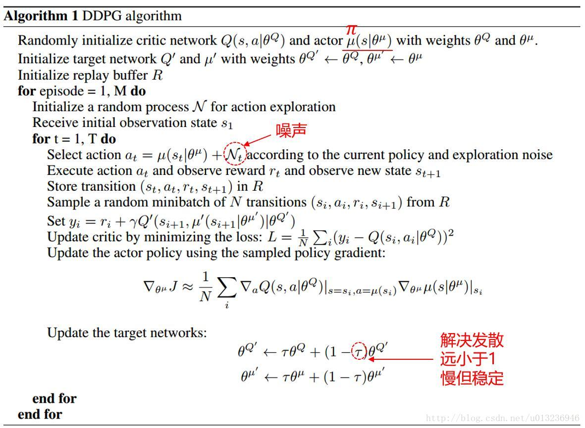

# 2020 秋招-按时间记
## 9.9
爱奇艺，上海-测试开发工程师  
美团，厦门-测试开发工程师  

## 9.11
爱奇艺，完成素质测评；  
拼多多一面挂；

## 9.13
10：00-12：00 美团笔试；  
15：00-17：00 爱奇艺笔试；  
19：00-21：00 网易雷火笔试；  

## 9.14
19：00   腾讯一面(CDG 测开)  
很凉  

## 9.15
15：00-15：30 海康威视面试  
感觉还行  

## 9.17
9：30 华为面试，预计三场一天面完。  

# 2020 秋招-按公司记

## 美团
2020.9.9：  
厦门：测试开发工程师；  

2020.9.13---10：00-12：00  
笔试(编程四道，A 三道；一题测试，不知道怎么评分)

## 上海航天八院
2020.7.18：八部-嵌入式软件开发工程师

## OPPO
2020.7.20： 
1. C/C++开发工程师  
2. 数据分析师

2020.8.29---19:00-20:30  
笔试
单选15题，填空2题，编程3题(只能用 c++，做出 0.4)

## PDD
2020.7.21：
1. 算法工程师
2. 数据分析师

2020.8.2：
完成在线笔试，共4题编程，完成度为：96%,5%,45%,0%；笔试未通过

2020.8.7：
再次投递：
1. 服务端研发工程师
2. 客户端研发工程师

2020.9.1---19：00-21：00  
笔试  (1+0+0.72+0.45)

2020.9.8---20:00-20:55  
一面：  
多态是怎么实现的？每个对象都有一个指针指向其所属类的虚函数表，调用虚函数时会通过该指针在虚函数表中找到对应的实现；对于没有 virtual 关键字的函数，编译器会在编译阶段就确定其函数实现，称为早绑定，而对于加了 virtual 关键字的函数，编译器会在运行时根据对象的具体类型动态确定其虚函数的实现，成为晚绑定；  
写一个 hash 表；  
vector,list 的区别，vector 的 push_back 是怎么实现的；  
policy gradient 和 value-based 的区别；  
一个算法题：一个字符串包含 数字、字母、小数点、正负号，求字符串中最小的数值；  
可以化为求符号后最大的数值或最小的单个数字；  

2020.9.11  
一面挂了；  
   
## 百度
2020.7.21：
上海-机器学习/数据挖掘/自然语言处理工程师

2020.9.3---19：00-21：00  
笔试，30单选，2简答，1设计，2编程(0.09+0.55)  

## 华为
2020.7.21：
AI工程师
(领域)AI 软件开发
(第一意向部门)智能汽车解决方案BU MDC产品部
(第二意向部门)智能汽车解决方案BU架构设计与集成验证部

2020.8.26---19:00-21:10
笔试：1.0 + 1.0 + 0.1 = 2.1  

2020.8.28---19:00  
在线测评  

2020.9.17---9：30  
一面

## 海康威视
2020.7.24：
1. 大数据算法工程师-研究院（杭州）
2. AI算法工程师-研究院（杭州）

2020.7.24：
完成在线测评

2020.8.18：
一面：
共聊了37分钟，先聊了项目，问了项目用的 PPO(由于 PG )，然后 TRPO、PG、DDPG，on/off-policy(模型更新是否依赖于当前决策策略), MC & TD(MC 无偏但方差大，TD 有偏但方差小), model base & model free(是否对环境建模)  
AlphaGo 用的基本方法(蒙特卡洛树搜索)，AlphaGo 是 model base 还是 model free (model base，围棋的环境动态是完全可知的，可以直接建模)；  

2020.9.15  
15:00-15:30 一面，感觉还行  

## 网易
2020.7.24：
雷火：强化学习工程师（游戏AI）
互娱：
1. 游戏AI研发工程师
2. AI研究工程师

2020.8.12：
网易互娱笔试：
100/100，30/100，40/100，未通过；  

2020.9.13---19：00-21：00  
雷火笔试；  

   
## 腾讯
2020.8.10：
技术研究-机器学习方向；TEG技术工程事业群；Robotics X

2020.8.21---19：30
一面
做了一道算法题，相当于 leetcode40：组合总和2(要求输出组合数而不用输出所有组合)，因为太紧张做了近半小时。  
然后问 AC 的原理，没答上来。  
PG 的原理、DPG 如何探索、TRPO 如何探索、PPO 解决的什么问题，SAC 原理；  

有没有用强化学习玩过什么游戏；  

2020.8.25：
提前批流程结束了，一面挂。

2020.8.23---20：00-22：00
笔试
0 + 0 + 0.8 + 0 + 0 = 0.8

2020.8.28  
更新简历  
软件开发-测试开发方向；TEG技术工程事业群；Robotics X  

2020.9.6  
笔试(1+1+0+1+0=3)  

2020.9.14  
19：00， CDG 一面，很凉  

## 滴滴
2020.8.10：
深度学习方向

2020.8.21---19：40
笔试，因腾讯一面放弃。  

2020.9.13---19：00  
今天早上才发短信约笔试，又跟雷火的笔试冲突了，放弃；  

## 米哈游
2020.8.10：
游戏安全工程师

2020.8.21---20：00  
笔试，因腾讯一面放弃。  

## 字节跳动
2020.8.17：
后端开发工程师-Data

2020.8.23---10:00-12:00
笔试
0.6364 + 0.2 + 0 + 0 = 0.8

2020.8.28---10:30-11:20
一面：自我介绍
c++:  
c++11 的新特性；  
auto；
类型转换：static_cast, const_cast, dynamic_cast, reinterpret_cast  
智能指针：share_ptr、unique_ptr，  
weak_ptr：配合 share_ptr 使用，可以从一个 share_ptr 或另一个 weak_ptr 构造，用于观测 share_ptr 指向的资源；但没有操作的权限，不会增加引用计数；可以通过 use_count() 获知资源的引用计数，或通过 expired() 判断计数是否为0，还能通过 lock() 获得对应的 share_ptr，从而操作资源；weak_ptr 主要用于解决 share_ptr 的循环引用的问题。  
重载和重写的区别;  
final: 表示类不能再被继承或虚函数不能再被重写;  
lambda 函数，与一般函数的区别：
1. lambda 函数可以定义在函数内部；  
2. lambda 不能有默认参数；
3. lambda 函数可以方便地进行参数绑定；
模板类，会不会产生冗余的代码：不会，编译器只有在实例化模板的时候才会生成代码；    

操作系统：  
分段与分页  
DMA  

计算机网络：  
正向代理和反向代理的区别

2020.9.1---11：00  
二面(本来应该是紧接在一面后的，但是由于面试官有事，所以推迟)
怎么学习的(可能是想问做过哪些项目之类的)  
了不了解大数据、数据库：没学过  
头条、抖音这些 app 是怎么找到服务器，获取数据的：http、https、tcp、udp、三次握手、DNS解析(负载均衡，一个域名对应多个 ip，DNS服务器负责分流)  
虚拟内存，段页式管理：  
进程与线程、调度策略、时间片是怎么判断的；  
队列怎么实现，单链表能实现队列吗？栈怎么实现队列？  

2020.9.9  
挂了

## 招银网络科技(招商银行)
2020.8.18：
数据研发工程师（杭州）

## bilibili  
2020.8.28：  
测试开发工程师（游戏）

## 爱奇艺
2020.9.9  
上海-测试开发工程师  

2020.9.13---15：00-17：00  
笔试(选择题基本不会，编程题3道全A，问答题交了白卷)  

# RL 面试准备

## 随机策略 vs 确定策略
1. 随机性策略，策略输出的是动作的概率，使用一个分布对动作进行采样选择，即每个动作都有概率被选到；
   优点，将探索和改进集成到一个策略中；缺点，需要大量训练数据。
2. 确定性策略，策略输出即是动作；
   优点，需要采样的数据少，算法效率高；缺点，无法探索环境。

## Value-Based vs Policy-Based
1. Value-Based是预测某个State下所有Action的期望价值（Q值），之后通过选择最大Q值对应的Action执行策略，适合仅有少量离散取值的Action的环境；
2. Policy-Based是直接预测某个State下应该采取的Action，适合高维连续Action的环境，更通用；

## model-based vs model-free
1. model-based，根据State和采取的Action预测接下来的State，并利用这个信息训练强化学习模型（知道状态的转移概率）；
2. model-free，不需对环境状态进行任何预测，也不考虑行动将如何影响环境，直接对策略或Action的期望价值进行预测，计算效率非常高。

因为复杂环境中难以使用model预测接下来的环境状态，所以传统的DRL都是基于model-free。

## SARSA
on policy TD  
$$Q(S_t,A_t)\leftarrow Q(S_t,A_t)+\alpha\big[R_{t+1}+\gamma Q(S_{t+1},A_{t+1})-Q(S_t,A_t)\big]$$  
使用下一个动作的 Q 更新 前一个动作的 Q；

## Q-learning
早期的重大突破(1989), off policy TD 的首次提出；  
$$Q(S_t,A_t)\leftarrow Q(S_t,A_t)+\alpha\big[R_{t+1}+\gamma \max_aQ(S_{t+1},a)-Q(S_t,A_t)\big]$$  
其更新对象 值函数 Q 是直接逼近最有值函数 $q_\star$ 的，而不是当前行动策略的值函数 $q_\pi$  
简化了算法的分析，并且能够更早地验证收敛。  

## Double Q-learning
Q-learning 中的 max 操作导致 Q 函数由于噪声的缘故被高估。  
使用另一个 Q2 函数来估计贪婪策略根据 Q1 选中动作的值，然后更新 Q1，能够有效防止高估现象。  

## DQN(参考 [CSDN 草帽B-O-Y](https://blog.csdn.net/u013236946/article/details/72871858))
value based, 仅有值函数网络，没有 policy 网络；  
1. 使用 深度神经网络，替代了 Q-learning 中的表；根据 Q-learning 使用 reward 来构造标签，解决 DL 需要大量标签的问题。  
2. 使用 经验池，解决 RL 中各状态前后相关且分布不均匀的问题。  
   经验池的功能主要是解决相关性及非静态分布问题。具体做法是把每个时间步agent与环境交互得到的转移样本 ($s_t,a_t,r_t,s_{t+1}$) 储存到回放记忆单元，要训练时就随机拿出一些（minibatch）来训练。（其实就是将游戏的过程打成碎片存储，训练时随机抽取就避免了相关性问题）
3. 使用两个网络分别产生 predict Q 和 target Q 值，解决值函数不稳定的问题。  
   使用另一个网络（这里称为TargetNet）产生Target Q值。具体地，$Q(s,a;\theta_i)$ 表示当前网络MainNet的输出，用来评估当前状态动作对的值函数；$Q(s,a;θ^−_i)$ 表示TargetNet的输出，代入上面求 TargetQ 值的公式中得到目标Q值。根据上面的Loss Function更新MainNet的参数，每经过N轮迭代，将MainNet的参数复制给TargetNet。  
   引入TargetNet后，在一段时间里目标Q值是保持不变的，一定程度降低了当前Q值和目标Q值的相关性，提高了算法稳定性。
   
DQN是第一个将深度学习模型与强化学习结合在一起从而成功地直接从高维的输入学习控制策略。

### 创新点：
基于Q-Learning构造Loss Function（不算很新，过往使用线性和非线性函数拟合Q-Table时就是这样做）。
通过experience replay（经验池）解决相关性及非静态分布问题；
使用TargetNet解决稳定性问题。

### 优点：
算法通用性，可玩不同游戏；
End-to-End 训练方式；
可生产大量样本供监督学习。

### 缺点：
无法应用于连续动作控制；
只能处理只需短时记忆问题，无法处理需长时记忆问题（后续研究提出了使用LSTM等改进方法）；
CNN不一定收敛，需精良调参。

## DDPG(参考 [CSDN 草帽B-O-Y](https://blog.csdn.net/u013236946/article/details/73243310))
DQN 无法用于连续动作控制，DDPG 是基于 DPG 对 Q-learning 的拓展，针对 DQN 提出的可用于连续动作控制的 AC 框架的算法，可解决连续动作空间上的 DRL 问题。  

使用确定性策略无法探索环境，如何解决？
利用off-policy学习方法。off-policy是指采样的策略和改进的策略不是同一个策略。  
类似于DQN，使用随机策略产生样本存放到经验回放机制中，训练时随机抽取样本，改进的是当前的确定性策略。  
整个确定性策略的学习框架采用AC的方法。  

在DDPG中，分别使用参数为 $\theta^\mu$ 和 $\theta^Q$ 的深度神经网络来表示确定性策略 $a=\pi(s|\theta^\mu)$ 和动作值函数 $Q(s,a|\theta^Q)$。  
其中，策略网络用来更新策略，对应 AC 框架中的行动者；值网络用来逼近状态动作对的值函数， 并提供梯度信息， 对应 AC 框架中的评论家。目标函数被定义为带折扣的总回报：  
$$J(\theta^\mu)=E_{\theta^\mu}[r_1+\gamma r_2+\gamma^2r_3+\cdots]$$

通过随机梯度法对目标函数进行端对端的优化（注意，目标是提高总回报 J）。Silver等人证明了目标函数关于 $\theta^\mu$ 的梯度等价于Q值函数关于 $\theta^\mu$ 的期望梯度：  
$$\frac{\partial J(\theta^\mu)}{\partial \theta^\mu} = E_s[\frac{\partial Q(s,a|\theta^Q)}{\partial \theta^\mu} ]$$

根据 $a=\pi(s|\theta^\mu)$ 可得：

$$\frac{\partial J(\theta^\mu)}{\partial \theta^\mu} = E_s[\frac{\partial Q(s,a|\theta^Q)}{\partial a} \frac{\partial \pi(s|\theta^\mu)}{\partial\theta^\mu} ]$$

通过 DQN中更新值网络的方法来更新评论家网络，梯度信息为：  
$$\frac{\partial L(\theta^Q)}{\partial \theta^Q}=E_{s,a,r,s'\sim D}[(TargetQ - Q(s,a|\theta^Q))\frac{\partial Q(s,a|\theta^Q)}{\partial \theta^Q}]$$
$$TargetQ=r+\gamma Q'(s',\pi(s'|\theta^{\mu'})|\theta^{Q'})$$

算法伪代码：  

区别于DQN，DQN每隔一定的迭代次数后，将MainNet参数复制给TargetNet；而DDPG中TargetNet的参数每次迭代都以微小量逼近MainNet的参数。

##