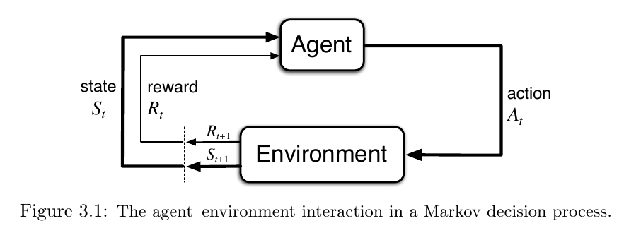
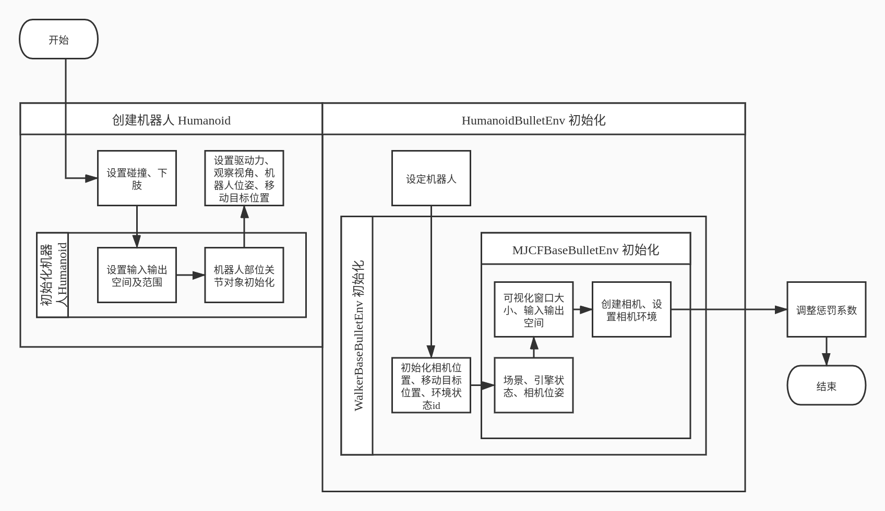
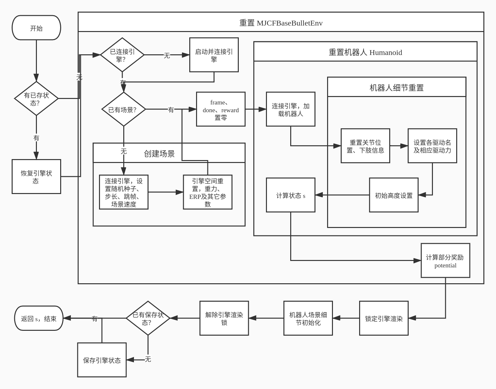
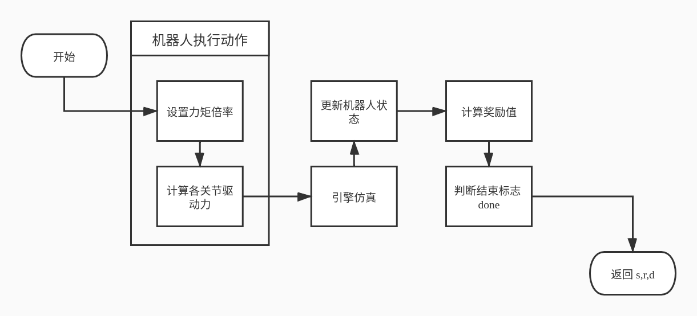

# 优化算法
## 强化学习
RL 问题是通过交互学习达到一个目标，MDPs 是对这种问题的最简洁的表达。  
* *agent*：学习和做出决策
* *environment*：agent 的交互对象，除了 agent 以外的一切

agent 和 environment 的交互是持续的，agent 选择 actions ，environment 根据 action 给出新的 state  
environment 也会给出 rewards ，rewards 是 agent 需要通过不断决策来提高的一个数值

agent 与 environment 在每个离散时间步 $t=0,1,2,3，\dots$ 做交互(离散使问题变得更简单)  
在每个 $t$ ，agent 接收 environment 的状态 *state*, $S_t \in \mathcal S$ 并基于此选择一个 *action*，$A_t \in \mathcal A(s).$ 在下一步，作为 action 的结果， agent 会收到一个数值 *reward*, $R_{t+1} \in \mathcal R \subset \mathbb R$ ，并发现状态发生了改变(进入 $t+1$ )，得到 $S_{t+1}$.   
交互轨迹:  

$$
S_0,A_0,R_1,S_1,A_1,R_2,S_2,A_2,R_3,\dots 
$$

在一个 *finite* MDPs 中，states，actions 和 rewards 取值的集合($\mathcal S, \mathcal A, and\ \mathcal R$)中的元素个数都是有限的。  
在这种情况下，随机变量 $R_t$ 和 $S_t$ 有明确定义的离散概率分布，且仅依赖于前一个 state 和 action.  
即对于这些随机变量，出现在时间 $t$ 的具体值，$s'\in \mathcal S$ 和 $r \in \mathcal R$ ，有一个概率：  

$$
p(s',r\ |\ s,a)\doteq \mathrm{Pr}\{S_t=s',R_t=r\ |\ S_{t-1}=s,A_{t-1}=a\}
$$

条件概率在此处表明对于所有的 $s \in \mathcal S,\ a\in \mathcal A(s).$，其概率和为 1:  

$$
\sum_{s'\in \mathcal S}\sum_{r\in \mathcal R}p(s',r\ |\ s,a)=1, \quad \text{for all } s \in \mathcal S,\ a\in \mathcal A(s).
$$

四参函数 $p$ 完整地表述了一个有限马尔科夫决策的动态过程。利用它能够计算关于 environment 的一切其它信息。  
比如**状态转移概率**(*state-transition probabilities*):  

$$
p(s'\ |\ s,a)\doteq \mathrm{Pr}\{S_t=s'\ |\ S_{t-1}=s,A_{t-1}=a\}=\sum_{r\in \mathcal R}p(s',r\ |\ s,a).
$$

### 强化学习的优化目标
在 RL 中，agent 的目标被数值化为 reward $R_t\in \mathbb R$，由 environment 传给 agent  
agent 的目的是最大化其所获得的 reward 之和  
用**奖励假设**(*reward hypothesis*)来描述：
* 我们的目标用最大化一个期望来表示，该期望为所受到的数值信号(reward)的累计和的期望值

agent's goal 的正式定义：最大化一个**期望回报**(*expected return*) $G_t$ ，其最简单的情况：  

$$
G_t\doteq R_{t+1}+R_{t+2}+R_{t+3}+\cdots +R_T,
$$

此处 $T$ 为最后一个时间步，称为 *terminal state*，在 agent-environment 之间的交互自然地终结时(比如棋局分出胜负)，这一整个过程称作 *episode*   
在这种 *episodic tasks* 中，有时需要区分有无 terminal state 的状态集： $\mathcal S$ 和 $\mathcal S^+$.  
$T$ 是一个随机变量，在不同的 episode 中是随机的。  

与之相反的，*continuing tasks* 是不会自然终结的任务，比如一个任务周期很长的机器人，此时其 terminal state $T=\infty$ ,那么回报也很自然的无穷大。

使用**折扣**(*discounting*)来定义回报：  

$$G_t\doteq R_{t+1}+\gamma R_{t+2}+\gamma^2R_{t+3}+\cdots =\sum_{k=0}^\infty\gamma^kR_{t+k+1},$$  

$0\leq \gamma \leq 1$，是一个参数，叫做**折扣率**(*discounting rate*)

## Proximal Policy Optimization(PPO) 
PPO 是由 John Schulman 于 2017 年提出的一种策略梯度算法，是目前最优秀的强化学习算法之一。  
PPO 适用于连续动作空间，是一种 on-policy 算法。  
原始的策略梯度算法的优化目标为：

$$\nabla_{\theta} J(\pi_{\theta}) = E_{\tau \sim \pi_{\theta}}\Bigg[{\sum_{t=0}^{T} \nabla_{\theta} \log \pi_{\theta}(a_t|s_t) A^{\pi_{\theta}}(s_t,a_t)}\Bigg]$$

参数更新公式为 $\theta_{k+1} = \theta_k + \alpha \nabla_{\theta} J(\pi_{\theta_k})$

其中 $A^{\pi_\theta}(s_t,a_t)$ 表示在状态 $s_t$ 时动作 $a_t$ 相对于其他动作的优势程度。  
策略梯度存在稳定性差的问题，这是因为参数空间的微小变化在策略选择上却有着极其显著的差别，越复杂的模型这个情况越明显。
因此在更新时，无法选择稍大的更新幅度，而策略的迭代又依赖于参数的更新，更新幅度太小导致策略无法改进。这就产生了矛盾，即设定的 $\alpha$ 太小则策略更新缓慢，太大则策略极其不稳定，出现崩溃现象。  

PPO 在此问题上做出了改进：  
其参数更新公式为： $\theta_{k+1} = \arg \max_{\theta} \underset{s,a \sim \pi_{\theta_k}}{{\mathrm E}}\left[L(s,a,\theta_k, \theta)\right]$

其中 $L(s,a,\theta_k,\theta) = \min\left(
\frac{\pi_{\theta}(a|s)}{\pi_{\theta_k}(a|s)}  A^{\pi_{\theta_k}}(s,a), \;\;
\text{clip}\left(\frac{\pi_{\theta}(a|s)}{\pi_{\theta_k}(a|s)}, 1 - \epsilon, 1+\epsilon \right) A^{\pi_{\theta_k}}(s,a)
\right)$

为了便于理解，可以将其写作：$L(s,a,\theta_k,\theta) = \min\left(
\frac{\pi_{\theta}(a|s)}{\pi_{\theta_k}(a|s)}  A^{\pi_{\theta_k}}(s,a), \;\;
g(\epsilon, A^{\pi_{\theta_k}}(s,a))
\right)$

其中 $g(\epsilon, A) = \left\{
    \begin{array}{ll}
    (1 + \epsilon) A & A \geq 0 \\
    (1 - \epsilon) A & A \lt 0.
    \end{array}
    \right.$

如此，当 A 为正时，可以增大该动作的概率；A 为负时，可以减小该动作的概率。  
且概率变化的范围被限定在 $(1-\epsilon,1+\epsilon)$ 之间，避免动作空间的巨大变化，也就避免了策略的崩溃。  

# 环境设计
环境的主要框架如下：

总体流程：

创建环境：

重置环境：

执行动作：

## 目标与奖励设计
机器人的目标是在保持直立的前提下向固定方向前进，其奖励表达式如下：

$$R = \omega_ar_a+\omega_pr_p+\omega_er_e+\omega_cr_c$$

其中 $r_a$ 为机器人是否处于直立状态，$r_p$ 为机器人与目标点距离，$r_e$ 为机器人当前输出功率，$r_c$ 为机器人是否产生肢体之间的互相碰撞。$\omega_a,\omega_p,\omega_e,\omega_c$ 分别为其系数，暂时设定值如下：

|系数|值|
|----|----|
|$\omega_a$|2|
|$\omega_p$|-1|
|$\omega_e$|-2|
|$\omega_c$|-1|

## 提前终止
在训练前中期，由于策略还不完善，机器人往往在很短的一段时间运动后就倒地了。  
而倒地起身并不是学习的目标，如果放任其继续学习，对直立前行的目标并无帮助，反而会由于其大量无意义行为使参数走向未知空间。  
因此，在机器人倒地后，提前终止该 episode，避免其陷入无意义学习。  

## 随机初始化
随机初始化的作用是让状态分布更加广泛，避免每次的轨迹都起始于相同状态，提高模型的泛化性能。  
随机初始化的实现方式：
在每次环境重置时对机器人初始姿态做一定的微调，包括各关节角度以及躯干倾角。  

## 机器人模型
机器人模型使用了 pybullet 自带的人性机器人描述文件，上身部分仅保留腹部主躯干部分，去除头颈、上肢等。  
关节自由度方面包括：腹部 1个，髋关节 3个，膝关节 1个，踝关节 1个。  

## ZMP
ZMP是传统的步态设计中被广泛采用的方法，缺点是对功率、速度限制较大，且抗干扰能力差。  

## 参考文献
基于深度强化学习的准被动双足机器人步态控制策略研究  
基于深度强化学习的双足机器人步行运动控制  
基于深度强化学习的四足机器人运动控制发展现状与展望  
**仿生机器人运动步态控制：强化学习方法综述**  

四足机器人步态规划与运动控制研究  
    四足机器人的机械结构分为全膝式、全肘式、前肘后膝式(内膝肘式)、前膝后肘式(外膝肘式)。  
    四足机器人典型步态分为三角步态、对角步态(trot步态)、骝蹄步态、跳跃步态等；其中对角步态运动过程中至少有两条腿处于支撑状态，需要一定速度以保持稳定性，当处于一个小跑的状态时，能耗特性最好；三角步态适用于慢速爬行，是具有最好稳定性的步态之一；  
    足端轨迹的弧长对应其抬腿时间，抬腿时间越短的四足机器人，其跨越障碍物的能力就越差。  
    四足机器人腿越长越稳，机身质量越大越稳，迈步频率越快越稳。  

Stability Criterion for Dynamic Gaits ofQuadruped Robot  
    提出一种评估四足机器人动态平衡能力的方法，现在对机器人动态平稳性没有较好的判据，常用的ZMP有缺点。  

**Optimal multi-criteria humanoid robot gait synthesis - An evolutionary approach**  
    提出一种基于进化算法的类人机器人步态生成方法，主要考虑指标为：最小能量和最小扭矩变化。  

A Comparative Study among Three Automatic Gait Generation Methods for Quadruped Robots  
    对比了三种步态生成方法(GA、GP、CPG),对 Bioloid制造的四足机器人进行了 Webots 仿真，结论为：  
    GP 在最大速度方面具有优势，GA和CPG 方法的平均速度性能较好，CPG 法在运动高度和高度变化方面由于 GA 和 GP 法。  
    